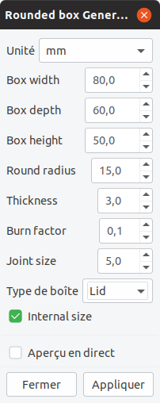
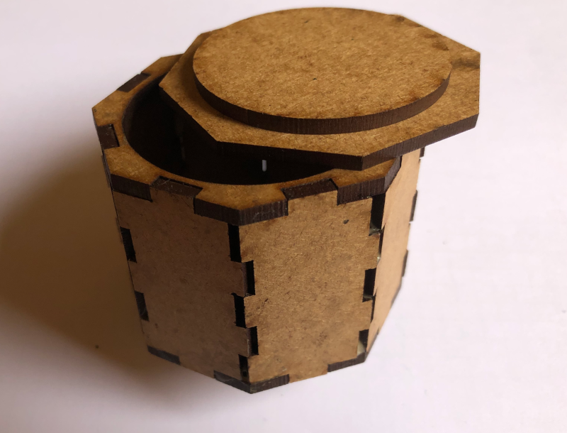
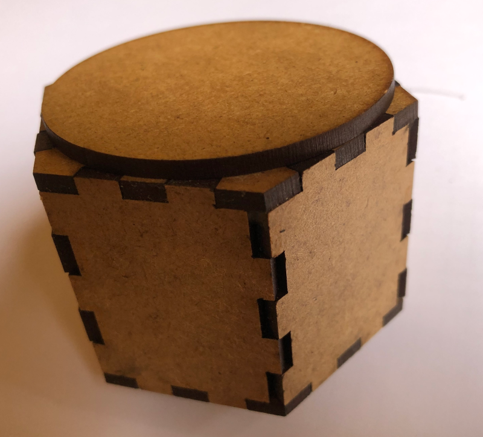
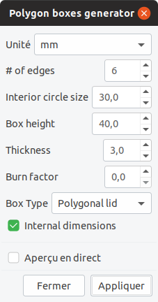
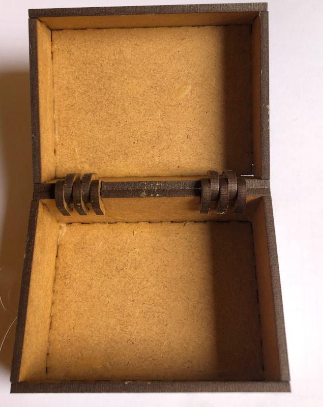
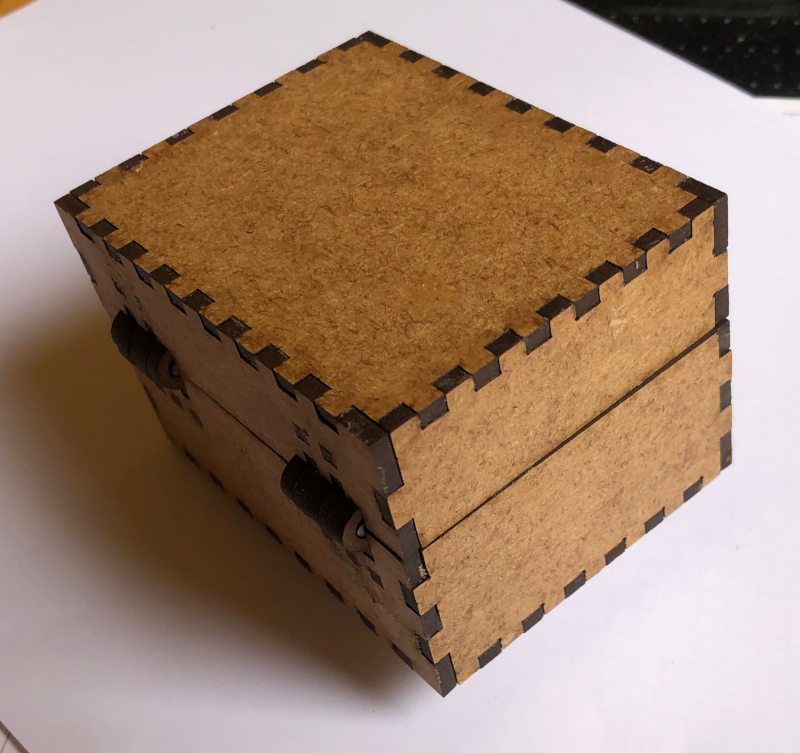
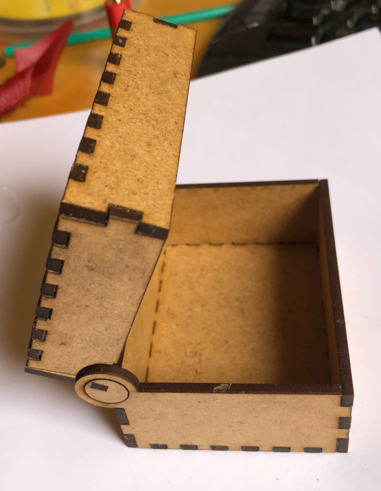
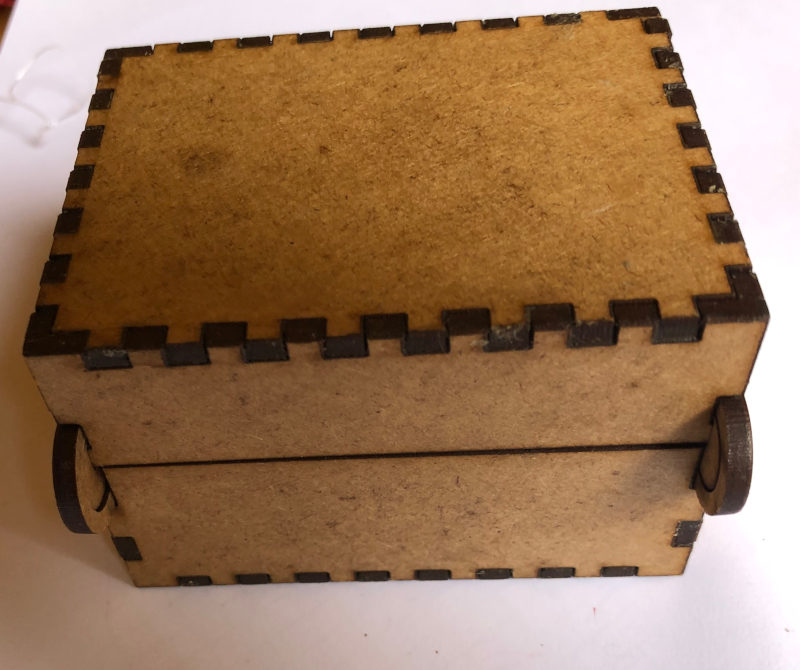
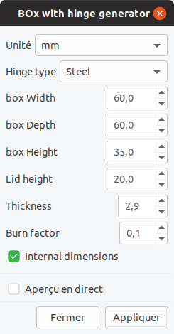

#Making boxes with a laser cutting machine

Laser cutting machines are somewhat magical. They enable the non gifted guy with two left hands (that's me) to have very nice results.

In this project, I use a laser cutting machine to create wood boxes. They are several types of boxes, detailled below. In any case, the generator is an inkscape extension.

This project is based on boxes made by Florian Festi, see /[https://www.festi.info/boxes.py/](https://www.festi.info/boxes.py/)  . But our laser cutting machine software has some flaws, and do not work well with the svg code generated. So I have decided to build an extension which has simpler generated code and which works well with our laser cutting machine.
###Boxes types
####Rounded boxes
Here, the boxes are "rounded", the side is made of flex, so the woord could be bent. The wood should be thin (max 5mm or 0.2inch) thick wood will not bend. The best results are obtained with MDF, with plywood, the result could be difficult to assemble, as it could break easily.  It is possible to add a lid, in this case you will have to glue the top's interior with the lid itself so the lid will stay in place.
 
When chosen, this extension will open a dialog box with several options fields.

In my case some text appears in French language (my default language) because of the inkscape automatic translation feature. For French speakers, I have a version which is entirely in French.
1. Unit : unit to be chosen, should be mm or inch.
2. box width, depth and height : the box dimensions. If "Internal size" is selected, give the dimensions inside the box, the actual box will be larger by 2*thickness.
3. Round radius : a larger value will lead to a more rounded box. Beware, if too high, an error will occur if there is not enough place to add joints. If too low,  you will enventually break the wood during assembly. Minimum value is 10mm, which is fine with 3mm thick wood.
4. Wood thickness : as already mentionned should not be too thick; values between 3 and 5 mm (0.1 to 0.2 inch) give the best results. 
 5. Burn factor : In order to compensate for the laser ray width, external joints will be larger than internal ones. This will allow to build the box without (too much) glue. 
 6. Joint size : the size of the joints, threre should be at least 2 joints on each edge.
 7. box type : you could choose between an open box (without lid), a closed box or a box with lid. 
 8. Internal size : as explained before, check this box if dimensions are internal, otherwise they will be overall.
 
 When all parameters are set, click on apply and a box will be created. This box is enclosed in an inkscape group. Each element in a group has an id (top, bottom, side) which explain which piece is, but this should be straight forward.
 
####Polygon boxes
 
The upper and lower edges of theses boxes is a polygon. Here is two examples of theses boxes

When chosen, this extension will open a dialog box with several options fields.

In my case some text appears in French language (my default language) because of the inkscape automatic translation feature. For French speakers, I have a version which is entirely in French.
1. Unit : unit to be chosen, should be mm or inch.
2. Number of egdes : choose an integral number. Should not be too large, as a joint is mandatory per side. 
3. Interior circle size : give the radius of circle which is included in the polygon.
4. Box height. If "Internal size" is selected, give the dimensions inside the box, the actual box will be larger by 2*thickness..
5. Wood thickness. 
6. Burn factor : In order to compensate for the laser ray width, external joints will be larger than internal ones. This will allow to build the box without (too much) glue. 
 7. box type : you could choose between an open box (without lid), a closed box or a box with lid which is either polygonal or circular. 
 8. Internal size : as explained before, check this box if dimensions are internal, otherwise they will be overall.
 
 When all parameters are set, click on apply and a box will be created. This box is enclosed in an inkscape group. Each element in a group has an id (top, bottom, side) which explain which piece is, but this should be straight forward.
 
 
####Boxes with hinges
 
You can draw boxes with hinges, either steel hinge or integrated wood hinge (no other part).
Here is the box with steel hinge
. 
I use a 3mm nail to build the hinge, it has to be cut at the right length.
 
 Then the box with integrated wood hinge
. 
No other part is needed to build this box. The lid move is a little less smooth than with the steel hinge, as there is more friction with wood than steel.
When chosen, this extension will open a dialog box with several options fields.

In my case some text appears in French language (my default language) because of the inkscape automatic translation feature. For French speakers, I have a version which is entirely in French.
1. Unit : unit to be chosen, should be mm or inch.
2. Hinge type, choose either 'steel' or 'integrated wood'
3. box width, depth and height : the box dimensions. If "Internal size" is selected, give the dimensions inside the box, the actual box will be larger by 2*thickness.
4. Lid height. Give the height of the lid. Beware, should not be too low, must have room for the hinge.
5. Wood thickness. 
6. Burn factor : In order to compensate for the laser ray width, external joints will be larger than internal ones. This will allow to build the box without (too much) glue. 
 7. box type : you could choose between an open box (without lid), a closed box or a box with lid which is either polygonal or circular. 
 8. Internal size : as explained before, check this box if dimensions are internal, otherwise they will be overall.
 
 When all parameters are set, click on apply and a box will be created. This box is enclosed in an inkscape group. Each element in a group has an id (top, bottom, side) which explain which piece is, but this should be straight forward.
 
 
###Software installation
First locate your inkscape extension directory, this directory is listed at Edit > Preferences > System: User extensions.
First you have to choose your language. If you select english, copy all files ending with 'en.inx' in your inkscape extension directory. If you prefer french, choose files ending with 'fr.inx'.
Then copy the program files (with an .py extension) also in your inkscape extension directory.
After a restart of Inkscape, these new extensions should appear in the menu extensions/Fablab

Enjoy !
If you have issues, let me know.